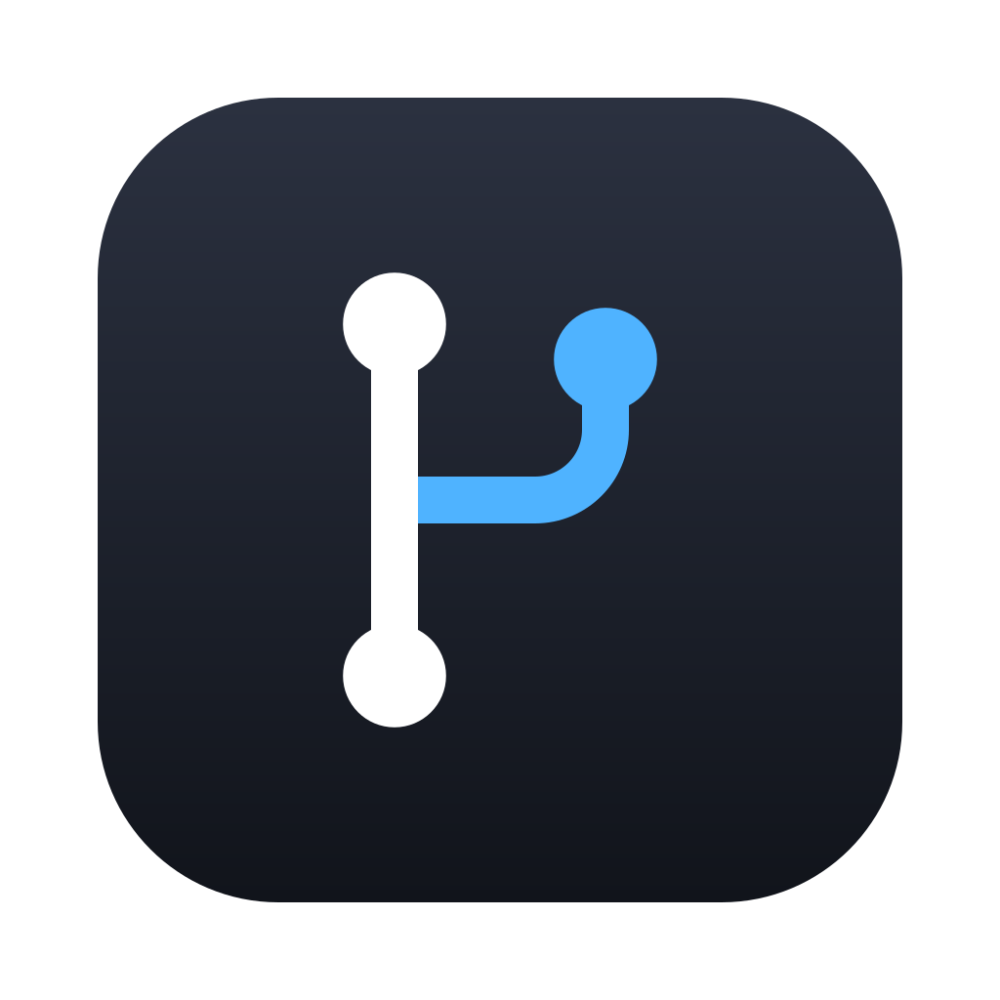

# gitmenu



[](https://github.com/semanticist21/gitmenu/releases/latest)
[](LICENSE)
[](#install)

VS Code's Source Control and GitLens-style views, in a lightweight macOS menu bar app. Keep your editor for code — gitmenu handles the git panel, diffs, and the commit graph, one click above whatever you're working on.

<!-- TODO(demo): record a ~10s GIF — open the panel, browse the commit graph, stage and commit a change — then show it here:
 -->

[Download](https://github.com/semanticist21/gitmenu/releases/latest) · [Product page & screenshots](https://kkom.net/products/gitmenu) · `brew tap kobbokkom/tap && brew install --cask kobbokkom/tap/gitmenu`

## What it does

- **Source Control** — staging, commit box, sync, stash, and conflict flow that follow VS Code's git extension, so nothing needs re-learning
- **Commit Graph** — lanes, branches, remotes, tags and stashes across all branches, with filters and search; lanes are computed in Rust
- **Diffs** — side-by-side or inline, syntax-highlighted by Shiki in a Web Worker; blame one toggle away, patch-level stage and revert like VS Code's
- **History** — File History follows renames, Line History follows your selection (`git log -L`), plus Search & Compare
- **Views** — Branches, Remotes, Tags, Stashes, Worktrees, Contributors, like GitLens
- **Remotes** — GitHub, GitLab, Gitea, Bitbucket, Azure DevOps, and self-hosted domains via a `remotes` setting; avatars for your contributors
- **Menu bar tray** — activity badge while git runs, project tabs, Open in Terminal, detachable panel, global shortcut
- **Keyboard-first** — command palette (⌘⇧P), Quick Open for projects and recents (⌘P), VS Code-style keybindings and `keybindings.json`, VoiceOver-friendly trees
- **10 languages**, light/dark/system themes, on-device AI commit messages via Apple Foundation Models (optional)

Fast by design: reads go through [gix](https://github.com/GitoxideLabs/gitoxide), writes and network go through your system `git` — no bundled git, no libgit2. 0% CPU when idle, one WebView per window.

## Install

Grab the DMG from [Releases](https://github.com/semanticist21/gitmenu/releases/latest), or:

```sh
brew tap kobbokkom/tap
brew install --cask kobbokkom/tap/gitmenu
```

Requires macOS 13+ on Apple silicon. Releases are signed with a Developer ID certificate and notarized by Apple, so the DMG opens without a Gatekeeper prompt and `brew install` needs no extra step. The app checks for updates itself and asks before installing one; **About gitmenu → Check for Updates…** does it on demand.

If `brew` stops with `It seems the App source '/Applications/gitmenu.app' is not there`, the app was deleted or moved while Homebrew still lists an older version as installed. Clear that record, then install again:

```sh
brew uninstall --cask --force gitmenu
brew install --cask kobbokkom/tap/gitmenu
```

## Build from source

```sh
bun install
bun run tauri dev        # run the app
bun run tauri build      # bundle the app
bun run typecheck && bun run lint && bun run test   # frontend checks
cd src-tauri && cargo clippy --all-targets -- -D warnings && cargo test
```

Stack: Tauri 2, Rust (`gix` 0.87), Vite + React + TypeScript + Tailwind 4, coss ui components, Bun. `SPEC.md` is the full product specification (Korean), `AGENTS.md` the contributor handbook.

## License

[MIT](LICENSE). The command structure, shortcuts and wording follow the VS Code git extension and GitLens; both are MIT and credited in [THIRD_PARTY_NOTICES.md](THIRD_PARTY_NOTICES.md). gitmenu is not affiliated with Microsoft or GitKraken.
